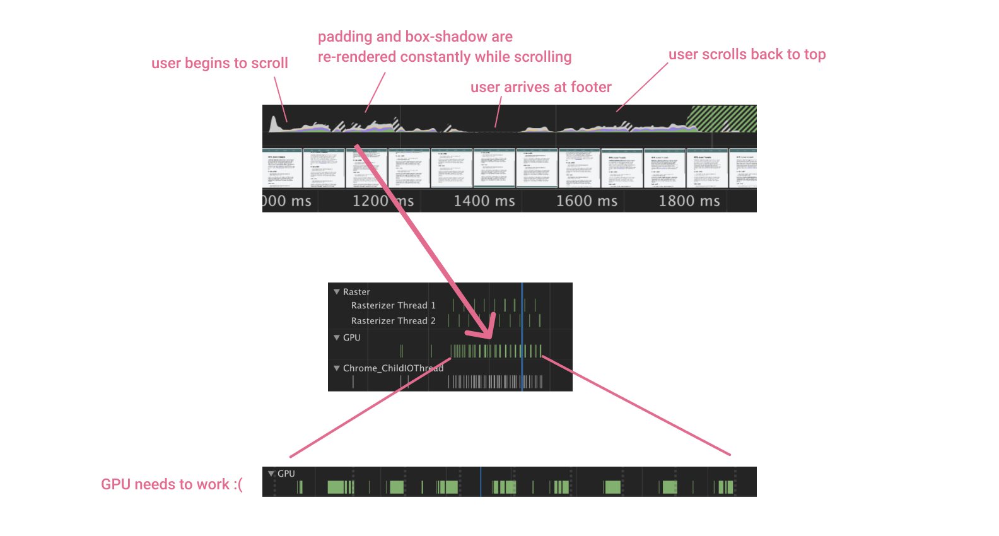

# Thoughts about performance of CSS transitions


## Intro: Why use animation on a website? 🤔

The great thing about websites is that we can interact with it – navigate, search, click, scroll, open. We don't *need* animation for user interactions – you can use Wikipedia just fine, even though it barely contains animations. 

But, with animation, we can improve user experience by providing feedback, indicate what will happen next, shifting attention.

Different options for animation are offered to frontend developers, but I would recommend you to choose CSS whenever possible and only use JavaScript as a last resort, see [rule of least power](https://en.wikipedia.org/wiki/Rule_of_least_power). You'll get a long way with CSS transitions. ✨


## What are CSS transitions? 
CSS transitions are the easiest form of animation – think about a button subtly changing color on hover. Let's start simple:

```css
.button {
	background-color: rgb(70 70 200 / 100%);
	transition: background-color 200ms; 👈
}

.button:hover {
	background-color: rgb(70 70 200 / 90%);
}
```

[See Codepen](https://codepen.io/franca_/pen/Yzpogrm)

Beware that every(!) animation comes at a cost. The browser has to *work* for this. Wikipedia is so fast because the browser doesn't have much to do. 


## Improve the performance of CSS transitions 🚀

- A fast website is less energy-consuming, thus cheaper and eco-friendlier. 🌱
- It improves user experience, especially mobile, and SEO positioning.

In regard to CSS transitions, remember this:

**Strive to use `opacity` and `transform` as sole transition properties.**


But... what's so different about opacity and transform?

Both properties can be used as animation "hacks". They *seem* to animate an element, but in reality it's a fake animation. With this, we can get the browser to only re-render *once* instead of continuously. As you'll see, we can change most transitions to using solely opacity / transform!


## Real-world example

How do you animate with opacity and transform *only* ? 

We'll animate a sticky header that
1. reduces its height on scroll to leave more space for the page content
2. gets a subtle shadow to delimit navigation from content.

Let's begin with a solution I would have implemented before learning about performance:

### Brute force solution 💥
- animate CSS `height` or `padding` property from hardcoded value x to x - n.
- animate CSS `box-shadow` from 0 to x.

Codepen: https://codepen.io/franca_/pen/MWbQQar

The important part, simplified:
```css
.header {
    padding: 30px;
	transition: padding 300s, box-shadow 300s; /* animation */
}

/* Same HTML element, but class added with JS on scroll */
.header--scrolling { 
    padding: 10px; /* reduced height */
    box-shadow: 0 8px 40px 0 gray; /* subtle shadow */
}
```

#### What happens behind the scences?

Browser rendering is a complex topic. For a deep dive, I recommend you [this article series](https://developers.google.com/web/updates/2018/09/inside-browser-part1) by Mariko Kosaka, an inspiring Google developer.

Simplified, the browser's graphics processing unit (GPU) needs to render every new state of our transition:



[[ GPU Video]] ✅

### Second version: optimized for performance ✨

Codepen: https://codepen.io/franca_/pen/yLVvvgv

#### First step: box-shadow

Initial situation: A transparent ::before element with a box-shadow ist placed just at the same place the header sits.
```css
.header {
    ...
}

.header::before {
	content: " ";
	position: absolute;
	top: 0;
	right: 0;
	bottom: 0;
	left: 0;
	opacity: 0; /* Hidden by default. */
	box-shadow: 0 8px 40px 0 gray; /* 👈 Shadow! */
}
```

We can then "fake animate" the box-shadow by simply setting the ::before element's opacity to 1;

[[Visualization of ::before element ]] ✅

```css
.header {
    ...
}

.header::before {
	...
	opacity: 0;
	box-shadow: 0 8px 40px 0 gray;
	transition: opacity 300s;
}

.header--scrolling::before {
	opacity: 1; /* ✨ Reveal box shadow on scroll ✨ */
}
```

#### Second step: height

This one is a little tricky. You're lucky if you can just `scale` your header, but the header's content would be scaled as well. But, we can use the `transform` property to shift the header a little more to the top. Then, we have to shift *down* the header's content a little so that it still sits at the center.

[[Visualization of header shifting]] ✅

- on scroll, header is shifted upwards
- on scroll, nav (which is header's content) is shifted a little bit downwards to be centered again

```css
.header {
    padding: 30px;
}

.header--scrolling { 
    transform: translateY(-20px);
}

.header--scrolling .nav {
    transform: translateY(10px);
}
```

In the last step, we animate the `transform` of header and nav:
```css
.header {
    padding: 30px;
    transition: transform 300s; /* Smooth transition upwards */
}

.header--scrolling { 
    transform: translateY(-20px);
}

.nav {
	transition: transform 300s; /* Smooth transition downwards */
}

.header--scrolling .nav {
    transform: translateY(10px);
}
```


### opacity
- the effect is already there from the beginning, only revealed on transtion
    - because of that, browser doesn't have to re-paint everything

### transform
- the element *seems* to be moving, but it's not *really* moving
    - layout doesn't change at all
    - because of that, layout doesn't have to be re-painted


