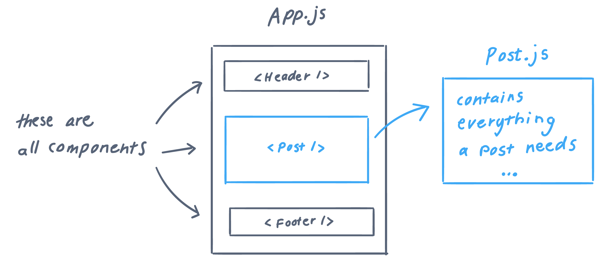
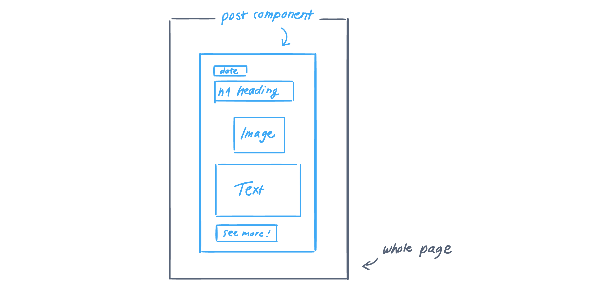
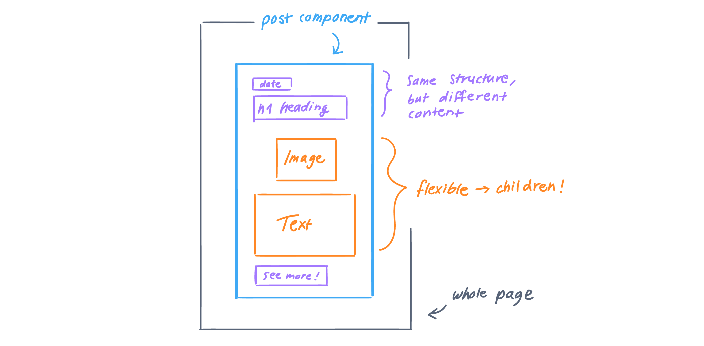
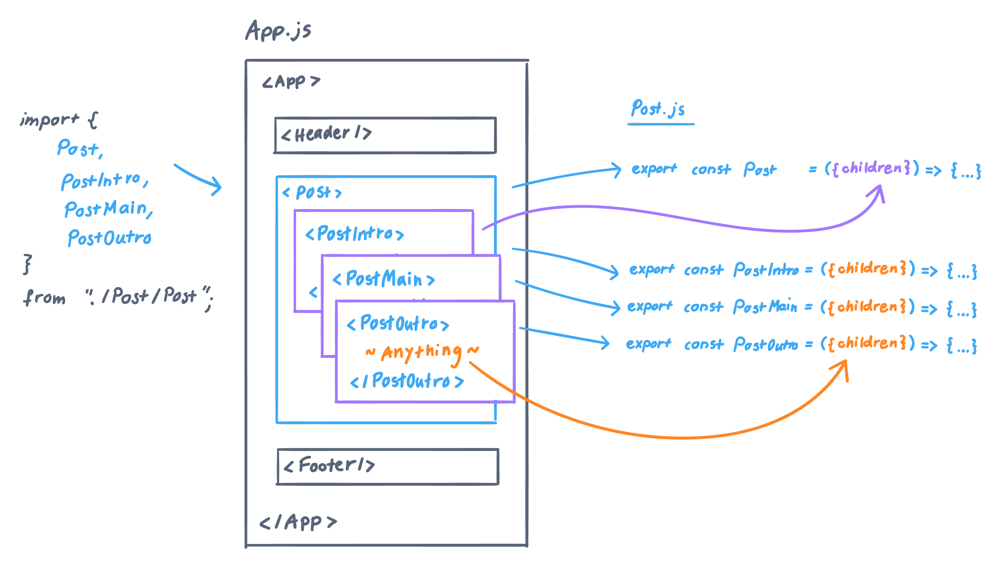

# React children 👶 💬 – why, when, how

## Use Case

React is great for building reusable components. Components often come in multiple variations – most of the time we can pass **props** to the component and all good.
```js
<Button color="red" text="Click me!" />
```

However, what if we build a component that doesn’t only change in style but also contains different JSX? This is often the case with complex, nested components like accordions, carousels and tabs or buttons with text and icon.

To keep it simple, imagine a `<Post />` component for a blog post. All posts look alike but vary in content.



The plain `Post` component could look like this:

```js
// Post.js
export const Post = () => {
  return (
    <section>
      <div>...Post content here...</div>
    </section>
  );
};
```

To use `Post` in `App.js` , it's *possible* to create a property, e.g. `content` that contains all kind of JSX like this:
```js
// App.js
<Post content={
  <>
    <h1>My first Post</h1>
    <p>Some intro text</p>
    <p>A paragaph</p>
  </>
}/>
```
*Note: the empty `<>` tag is a [Fragment](https://reactjs.org/docs/fragments.html#short-syntax).*

See the [CodeSandbox example here](https://codesandbox.io/s/props-example-8mks2?file=/src/App.js).

It’s just that this solution doesn’t look simple and clean. It’s not that we want to pass certain properties to the component, it’s more that we want to **define what’s inside**.  In this case, use React children!

## React Children In Action 👶

You don’t pass children like a property, you place it **inside the component tags** as if you'd write plain old HTML.

```js
// App.js
<Post>
  <h1>My first Post</h1>
  <p>Some intro text</p>
  <p>A paragaph</p>
</Post>
```
*This looks so much better! It feels like writing HTML with superpowers!* ✨

You created your own component `<Post>` and filled it with JSX tags. You can insert custom React components as well!



But – we have to tweak the component itself a little. At the moment, the Post component looks like this:
```js
// Post.js
export const Post = () => { ... }
```

As children are special properties, you don’t have to declare them when using the component, but you have to tell the component itself that **children are welcome**. The word `children` is a special word in the React world with a set meaning like `function` or `const`.

```js
// Post.js
export const Post = ({children}) => { ... } 
```

In the next step, you have to define the children's location inside the component’s JSX structure:

```js
// Post.js
export const Post = ({ children }) => {
  return (
    <section>
      ...
      <div>{children}</div>
      ...
    </section>
  );
};
```



See the [CodeSandbox example here](https://codesandbox.io/s/children-example-5z93h?file=/src/App.js)


## ⚠️ Caution
Only use children if you can’t control the component’s content. If you know that a component is always going to be based on the same JSX structure, it’s better to pass string props for the heading, etc. **Be as strict as possible.**

Also, don’t try to style the children. Don’t do this:
```js
// App.js
<Post>
  <h1 className="post__heading">My first Post</h1>
  <p>Some intro text</p>
  <p>A paragaph</p>
</Post>
```
You don’t have a place to define that CSS class. 

There are several options in this case:

### 1. Create Smaller Components

If the heading is used universally, you could create a Heading component:

```js
// App.js
<Post>
  <Heading>My first Post</Heading>
  <p>Some intro text</p>
  <p>A paragaph</p>
</Post>
```

### 2. Use Props Instead

If you want to use a special `post__heading` class, the `Post` component itself is the right place to do this. Just pass the heading as a normal prop.
```js
// App.js
<Post heading="My first Post"> // Property
  <p>Some intro text</p> // Children
  <p>A paragaph</p> 
</Post>
```

```js
// Post.js
export const Post = ({ heading, children }) => {
  return (
    <section>
      <div className="post">
        <h1 className="post__heading">{heading}</h1>
        {children}
      </div>
      <a>See all posts</a>
    </section>
  );
};
```

### 3. Split Component Into Smaller Functions

This is my advice if you want to style the children specifically and use more than one JSX tag.
```js
// App.js
<Post heading="My first Post">
  <p>Some intro text</p>
  <p>A paragaph</p>
</Post>
```

```js
// Post.js
const PostMain = ({ content }) => {
  return <div className="post__main">{content}</div>;
};

export const Post = ({ heading, children }) => {
  return (
    <section>
      <div className="post">
        <h1 className="post__heading">{heading}</h1>
        <PostMain content={children} />
      </div>
      <a>See all posts</a>
    </section>
  );
};
```
See it in action in [this CodeSandbox](https://codesandbox.io/s/split-component-into-smaller-functions-360eu?file=/src/Post/Post.js)

## Advanced Case: Split Up Your Children

We can go even further and split our `Post` components into intro, main and outro 😎

```js
// App.js
<Post heading="My first Post">
    <PostIntro>
      <p>Some intro text</p>
      <p>Intro paragaph</p>
    </PostIntro>
    <PostMain>
      ...
    </PostMain>
    <PostOutro>
      ...
    </PostOutro>
</Post>
```

`PostIntro`, `PostMain` and `PostOutro` are small, separate components that can be used as children inside the `Post` component.

```js
// Post.js
export const PostIntro = ({ children }) => {
  return <div className="post__intro">{children}</div>;
};

export const PostMain = ({ children }) => {
  return <div className="post__main">{children}</div>;
};

export const PostOutro = ({ children }) => {
  return (
    <div className="post__outro">
      {children}
      <a>See all posts</a>
    </div>
  );
};

export const Post = ({ heading, children }) => {
  return (
    <section>
      <div className="post">
        <h1 className="post__heading">{heading}</h1>
        {children}
      </div>
    </section>
  );
};
```

The `Post` component itself is "stupid" and doesn't know which children will be passed. This is a simple example, but if your components contain a lot of logic and/or JSX, this is a way to separate concerns.



You can find the finished example on [CodeSandbox here](https://codesandbox.io/s/advanced-u1wmo?file=/src/Post/Post.js). Feel free to fork and play with it!

---

## Linklist
- [React Docs: Composition vs Inheritance](https://reactjs.org/docs/composition-vs-inheritance.html)
- [React Docs: React Fragments](https://reactjs.org/docs/fragments.html#short-syntax)
- [Robin Wieruch: React function components](https://www.robinwieruch.de/react-function-component#react-function-component-props)